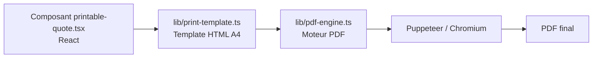

# 🌐 Routes API — Factouro

## 1. Vue d'ensemble

Les routes API se trouvent dans le dossier `app/api/`. Elles sont protégées par le middleware Clerk (sauf exceptions publiques comme `/api/webhooks`, `/api/uploadthing`, `/api/print`).

---

## 2. Récapitulatif des routes

| Route | Méthode | Protection | Description |
|-------|---------|-----------|-------------|
| `/api/print` | POST | Publique | Génération du PDF d'un devis via Puppeteer |
| `/api/pdf` | POST | Auth | Génération PDF (variante) |
| `/api/quotes/last-draft` | GET | Auth | Récupère le dernier brouillon de devis |
| `/api/clients/[id]/audit` | GET | Auth | Audit / historique d'un client |
| `/api/cron/client-reminders` | GET | Auth (cron) | Rappels automatiques clients |
| `/api/webhooks/stripe` | POST | Publique | Gestion des événements Stripe |
| `/api/uploadthing` | GET/POST | Publique | Upload de fichiers |
| `/api/user/status` | GET | Auth | Statut de l'utilisateur |

---

## 3. Détail des routes

### 3.1 `/api/print` — Génération PDF

- **Méthode** : `POST`
- **Protection** : Publique (liste blanche middleware)
- **Rôle** : Génère le PDF d'un devis en utilisant **Puppeteer** / Chromium (@sparticuz/chromium-min). Sert le HTML du template A4 et convertit en PDF.
- **Usage** : appelé par le client pour générer le PDF téléchargeable.

---

### 3.2 `/api/pdf` — Génération PDF (variante)

- **Méthode** : `POST`
- **Protection** : Auth (API protégée)
- **Rôle** : Variante du moteur PDF, utilise le pipeline `lib/pdf-engine.ts` + `lib/print-template.ts`.

---

### 3.3 `/api/quotes/last-draft` — Dernier brouillon

- **Méthode** : `GET`
- **Protection** : Auth
- **Rôle** : Retourne le dernier brouillon de devis de l'utilisateur connecté (pour la reprise en édition).

---

### 3.4 `/api/clients/[id]/audit` — Audit client

- **Méthode** : `GET`
- **Protection** : Auth
- **Paramètre** : `id` (identifiant du client)
- **Rôle** : Retourne l'audit / l'historique complet d'un client (devis, activités, timeline).

---

### 3.5 `/api/cron/client-reminders` — Rappels automatiques

- **Méthode** : `GET`
- **Protection** : Auth (destinée à être appelée par un cron)
- **Rôle** : Déclenche les rappels automatiques (relances) pour les devis en attente / clients à relancer.

---

### 3.6 `/api/webhooks/stripe` — Webhooks Stripe

- **Méthode** : `POST`
- **Protection** : Publique (signature Stripe vérifiée via `STRIPE_WEBHOOK_SECRET`)
- **Rôle** : Reçoit les événements Stripe (paiement réussi, abonnement modifié, etc.) et synchronise la base de données via `syncSubscription`.

---

### 3.7 `/api/uploadthing` — Upload de fichiers

- **Méthode** : `GET` / `POST`
- **Protection** : Publique
- **Rôle** : Route de configuration UploadThing pour l'upload de fichiers (logos, images). `core.ts` définit les endpoints d'upload.

---

### 3.8 `/api/user/status` — Statut utilisateur

- **Méthode** : `GET`
- **Protection** : Auth
- **Rôle** : Retourne le statut de l'utilisateur (plan, onboarding terminé, etc.) pour orienter le routing frontend.

---

## 4. Pipelines PDF

Le rendu PDF passe par plusieurs couches :

- `components/pdf/printable-quote.tsx` : rendu React du devis.
- `lib/print-template.ts` : génère le HTML servant à l'impression.
- `lib/pdf-engine.ts` : orchestration de Puppeteer/Playwright.
- `app/api/print` & `app/api/pdf` : routes d'entrée HTTP.