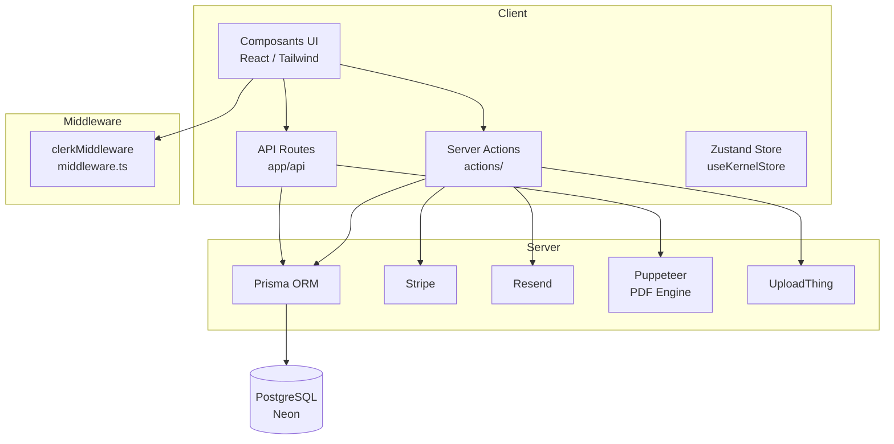

# 🏗️ Architecture — Factouro

## 1. Vue d'ensemble

**Factouro** est un SaaS web de création, gestion et envoi de devis professionnels, conçu pour les freelances et les TPE/PME. L'application offre une interface moderne de type **Spatial UI**, un éditeur de devis temps réel, la génération de PDF, l'envoi par email, la gestion complète des clients, du catalogue et de l'abonnement.

---

## 2. Stack Technique

| Catégorie | Technologie |
|-----------|-------------|
| **Framework** | Next.js 16 (App Router) |
| **Langage** | TypeScript 5 |
| **Base de données** | PostgreSQL (via Neon) |
| **ORM** | Prisma 7 (client généré dans `app/generated/prisma`) |
| **Authentification** | Clerk |
| **Paiement / Abonnement** | Stripe |
| **Email** | Resend |
| **PDF** | Puppeteer / Playwright (Chromium via @sparticuz/chromium) |
| **UI** | Tailwind CSS 4, Radix UI, shadcn/ui, Framer Motion |
| **Icons** | Phosphor Icons, Lucide, Heroicons |
| **State Management** | Zustand (useKernelStore) |
| **Validation** | Zod |
| **Upload de fichiers** | UploadThing |
| **Charts** | Recharts |
| **Tableaux** | TanStack Table |
| **Tests** | Vitest + Testing Library |

---

## 3. Architecture Globale



---

## 4. Structure du Projet

```
my-app/
├── actions/                  # Server Actions Next.js ("use server")
│   ├── billing-action.ts     # Abonnement Stripe, profil de facturation
│   ├── client-action.ts      # CRUD clients (paginated, search)
│   ├── client-activity-action.ts  # Timeline d'activités clients
│   ├── client-editor-action.ts    # Clients pour l'éditeur
│   ├── client-export-action.ts    # Export CSV clients
│   ├── client-import-action.ts    # Import CSV clients
│   ├── contact-action.ts     # Formulaire de contact (landing)
│   ├── dashboard-actions.ts  # Données dashboard avancé
│   ├── design-action.ts      # Thèmes disponibles
│   ├── logo-action.ts        # Upload du logo société
│   ├── quote-editor-action.ts     # Édition/sauvegarde des devis
│   ├── quote-event-action.ts      # Événements/timeline des devis
│   ├── quote-registry-action.ts   # Registre des devis (liste, statut, suppression)
│   ├── reminder-action.ts    # Rappels (relances)
│   ├── security-action.ts    # Sécurité, sessions, mot de passe
│   ├── send-quote-email.ts   # Envoi email + PDF
│   ├── settings-action.ts    # Paramètres utilisateur
│   ├── suggestion-action.ts  # Suggestions de services
│   ├── user-action.ts        # Profil utilisateur, paramètres société
│   └── __test__/             # Tests unitaires des actions
│
├── app/                      # App Router Next.js
│   ├── (auth)/               # sign-in, sign-up, sso-callback
│   ├── (dashboard)/          # home, dashboard, quotes, clients, billing, settings
│   ├── (editor)/             # Éditeur de devis (quotes/new, quotes/[id], export)
│   ├── (info)/               # Pages légales (contact, privacy, terms, legal)
│   ├── api/                  # Routes API
│   │   ├── clients/[id]/audit/    # Audit d'un client
│   │   ├── cron/client-reminders/ # Rappels automatiques clients
│   │   ├── pdf/ / print/          # Génération PDF
│   │   ├── quotes/last-draft/     # Récupération du dernier brouillon
│   │   ├── uploadthing/           # Upload de fichiers
│   │   ├── user/status/           # Statut utilisateur
│   │   └── webhooks/stripe/       # Webhooks Stripe
│   ├── generated/prisma/     # Client Prisma généré
│   └── onboarding/           # Onboarding des nouveaux utilisateurs
│
├── components/
│   ├── editor/               # Éditeur de devis
│   │   ├── quote-editor-layout.tsx    # Layout de l'éditeur
│   │   ├── studio-sidebar-left.tsx    # Sidebar client/catalogue
│   │   ├── studio-sidebar-right.tsx   # Sidebar finance/légal
│   │   ├── QuoteVisualizer.tsx        # Visualisation A4
│   │   ├── editor-header.tsx          # Header de l'éditeur
│   │   ├── client-selector-view.tsx   # Sélecteur de client
│   │   ├── create-client-dialog.tsx   # Création de client
│   │   ├── template-selector-modal.tsx # Sélecteur de templates
│   │   ├── studio-loader.tsx          # Loader du studio
│   │   ├── CreateQuoteClient.tsx      # Client de création de devis
│   │   └── export/                    # Page d'export/aperçu template
│   ├── landing/               # Page d'accueil (hero, features, pricing, FAQ...)
│   ├── pdf/                   # printable-quote.tsx (template PDF)
│   ├── shared/                # Composants partagés (new-quote-button, ui)
│   ├── spatial-dock.tsx       # Dock de navigation latéral
│   ├── spatial-status-bar.tsx # Barre de statut supérieure
│   └── ui/                    # Composants shadcn/ui
│
├── features/                  # Vues métier (Spatial UI)
│   ├── auth/                  # Formulaires de connexion/inscription
│   ├── billing/               # Vue facturation (spatial-billing-view)
│   ├── clients/               # Vue clients (spatial-clients-view)
│   ├── dashboard/             # Dashboard (KPIs)
│   ├── home/                  # Vue d'accueil
│   ├── quotes/                # Liste des devis (spatial-quotes-view)
│   ├── reminders/             # Rappels (use-reminders)
│   └── settings/              # Paramètres (spatial-settings-view)
│
├── hooks/                     # Hooks personnalisés
│   ├── use-kernel-store.ts    # Store Zustand global
│   └── use-debounce.ts        # Debounce
│
├── lib/
│   ├── auth.ts                # Wrapper auth Clerk (getClerkUserId, getCurrentUser)
│   ├── clerk-theme.ts         # Apparence UI Clerk
│   ├── constants.ts           # Constantes (DOMAIN_MAP, MAX_QUOTE_LINES)
│   ├── design-system.ts       # Tokens du Design System
│   ├── email.ts               # Envoi d'emails (Resend)
│   ├── notifications.ts       # Notifications
│   ├── pdf-engine.ts          # Moteur PDF (serveur)
│   ├── print-template.ts      # Template HTML de devis
│   ├── prisma.ts              # Client Prisma
│   ├── stripe.ts              # Client Stripe
│   ├── subscription.ts        # Logique d'abonnement
│   ├── template-system.ts     # Définition des templates A4
│   ├── uploadthing.ts         # Client UploadThing
│   ├── utils.ts               # Utilitaires
│   ├── templates/             # 15 templates HTML de devis
│   └── validations/           # Schémas Zod (client, quote, settings)
│
├── prisma/
│   ├── schema.prisma          # Modèle de données
│   └── migrations/            # Migrations
│
├── templates/                 # Template HTML statique (template-devis.html)
├── types/                     # Types TypeScript (client, dashboard, editor...)
└── middleware.ts              # Clerk middleware (auth)
```

---

## 5. Conventions de Code

### 5.1 Pattern `ActionResponse<T>`

Toutes les Server Actions retournent une réponse normalisée :

```typescript
type ActionResponse<T> = {
  success: boolean;
  data?: T;
  error?: string;
};
```

### 5.2 Authentication côté serveur

```typescript
// lib/auth.ts
import { auth, currentUser } from "@clerk/nextjs/server";

export const getClerkUserId = async () => (await auth())?.userId ?? null;
export const getCurrentUser = async () => await currentUser();
```

### 5.3 Design System tokenisé

Le fichier `lib/design-system.ts` centralise les tokens (couleurs, espacements, tailles) utilisés dans toute l'UI, via des constantes préfixées `DS_` (ex : `DS_ICON_SM`).

### 5.4 Spatial UI

L'interface repose sur le concept de **Spatial UI** :
- `spatial-dock.tsx` : dock latéral gauche de navigation
- `spatial-status-bar.tsx` : barre de statut supérieure (logo, recherche ⌘K, notifications)
- Fond animé et cartes "Bento" pour les contenus