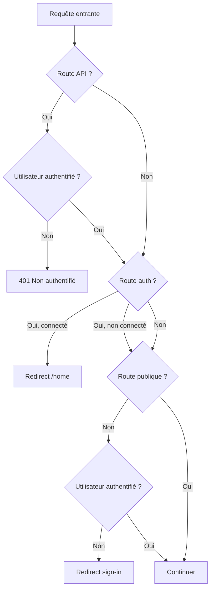

# 🔐 Authentification & Sécurité — Factouro

## 1. Vue d'ensemble

L'authentification est gérée par **Clerk** (Next.js SDK). Le middleware `middleware.ts` protège les routes, gère les routes publiques et redirige les utilisateurs connectés.

---

## 2. Middleware (`middleware.ts`)

```typescript
import { clerkMiddleware, createRouteMatcher } from "@clerk/nextjs/server";
import { NextResponse } from "next/server";
```

### 2.1 Routes publiques

```typescript
const isPublicRoute = createRouteMatcher([
  "/",
  "/sign-in(.*)",
  "/sign-up(.*)",
  "/sso-callback(.*)",
  "/api/webhooks(.*)",
  "/api/uploadthing(.*)",
  "/api/print(.*)",
  "/contact(.*)",
  "/privacy(.*)",
  "/legal(.*)",
  "/terms(.*)",
  "/favicon.ico",
]);
```

Accessibles **sans authentification** : landing page, pages d'authentification, webhooks, uploadthing, print, pages légales.

### 2.2 Routes API protégées

```typescript
const isApiRoute = createRouteMatcher(["/api/(.*)"]);
```

Le middleware bloque les routes API non-publiques si l'utilisateur n'est pas authentifié (réponse `401`).

### 2.3 Routes d'authentification (invités uniquement)

```typescript
const isAuthRoute = createRouteMatcher(["/sign-in(.*)", "/sign-up(.*)", "/sso-callback(.*)"]);
```

Si l'utilisateur est **déjà connecté** et tente d'accéder à `/sign-in`, `/sign-up` ou `/sso-callback`, il est **redirigé vers `/home`**.

### 2.4 Logique du middleware



---

## 3. Wrapper d'authentification serveur (`lib/auth.ts`)

```typescript
import { auth, currentUser } from "@clerk/nextjs/server";

export const getClerkUserId = async () => (await auth())?.userId ?? null;
export const getCurrentUser = async () => await currentUser();
```

- `getClerkUserId()` : retourne l'ID Clerk de l'utilisateur connecté, ou `null`.
- `getCurrentUser()` : retourne l'objet complet de l'utilisateur Clerk.

Ces wrappers sont utilisés dans **toutes** les Server Actions pour vérifier l'identité.

---

## 4. Thème Clerk (`lib/clerk-theme.ts`)

L'apparence de l'interface Clerk (pages de connexion/inscription) est personnalisée via `clerkAppearance` :
- Style sombre "Obsidian"
- Boutons sociaux en bas, sans logo
- Overrides de classes Tailwind pour les cartes, inputs, boutons, liens de footer, texte d'erreur
- Couleur primaire indigo (`#4f46e5`), texte zinc, radius `rounded-lg`

---

## 5. Sécurité — Fichier `security-action.ts`

Ce module regroupe les actions liées à la sécurité du compte :

| Fonction | Rôle |
|----------|------|
| `getSecurityProfile()` | Retourne le profil de sécurité (sessions actives). |
| `revokeSession(sessionId)` | Révoque une session. |
| `setInitialPassword(newPassword)` | Définit un mot de passe initial. |
| `updatePassword(current, new)` | Met à jour le mot de passe (après vérification). |
| `deleteAccountSecure(confirmEmail)` | Supprime le compte après confirmation par email. |

Le module utilise **@zxcvbn-ts** (bibliothèque d'estimation de force des mots de passe) pour valider la robustesse.

---

## 6. Interface `security-action.ts`

```typescript
export interface ParsedSession { ... }
export interface SecurityProfile { ... }
```

`SecurityProfile` contient notamment les sessions actives de l'utilisateur et les informations de sécurité du compte.

---

## 7. Protection des Server Actions

Toutes les Server Actions (`actions/*.ts`) utilisent la directive `"use server"` et commencent par une vérification d'authentification :

```typescript
"use server";

import { getClerkUserId } from "@/lib/auth";

export async function maAction() {
  const userId = await getClerkUserId();
  if (!userId) return { success: false, error: "Non authentifié" };
  // ...
}
```

---

## 8. Variables d'environnement (Authentification)

```env
NEXT_PUBLIC_CLERK_PUBLISHABLE_KEY="pk_..."
CLERK_SECRET_KEY="sk_..."