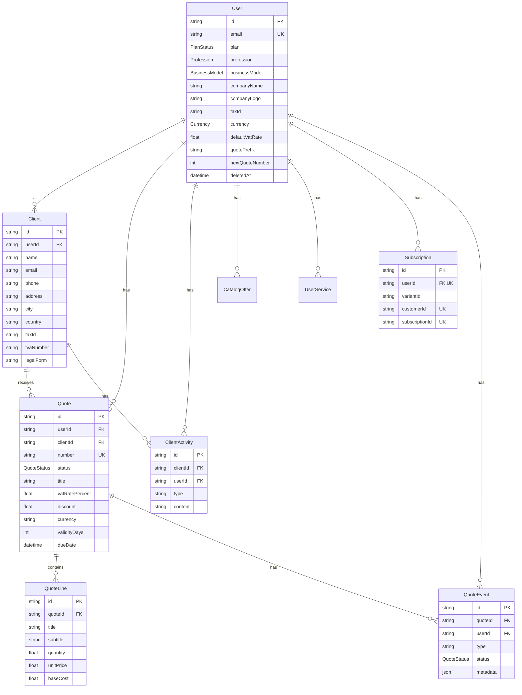

# 🗄️ Base de Données — Factouro

## 1. Contexte

La base de données est **PostgreSQL**, gérée via **Prisma 7** (ORM). Le fichier de définition se trouve dans `prisma/schema.prisma`. Le client Prisma est généré dans `app/generated/prisma`.

Le provider de datasource est `postgresql`, avec des adaptateurs Neon et PG (`@prisma/adapter-neon`, `@prisma/adapter-pg`).

---

## 2. Schéma Relationnel (ERD)



---

## 3. Modèles

### 3.1 User (`users`)

Utilisateur de la plateforme, lié à Clerk (l'`id` provient de Clerk).

| Champ | Type | Contrainte | Description |
|-------|------|------------|-------------|
| `id` | String | PK | ID Clerk |
| `email` | String | Unique | Email |
| `plan` | PlanStatus | default FREE | Plan d'abonnement |
| `profession` | Profession? | | Profession |
| `businessModel` | BusinessModel? | | Modèle économique |
| `companyName` | String? | | Nom société |
| `companyLogo` | String? | | Logo (URL) |
| `taxId` | String? | | N° fiscal |
| `taxIdLabel` | String? | default "NCC" | Libellé n° fiscal |
| `companyEmail` | String? | | Email pro |
| `companyPhone` | String? | | Téléphone |
| `companyWebsite` | String? | | Site web |
| `currency` | Currency | default XOF | Devise par défaut |
| `defaultVatRate` | Float | default 18.0 | TVA par défaut |
| `quotePrefix` | String | default "INV-" | Préfixe des devis |
| `nextQuoteNumber` | Int | default 1 | Numéro suivant |
| `defaultTerms` | String? | | Conditions générales |
| `companyAddressDetails` | String? | | Adresse détaillée |
| `companyCity` | String? | | Ville |
| `deletedAt` | DateTime? | | Soft delete |

**Relations :** `catalogOffers`, `clients`, `clientActivities`, `subscription`, `userServices`, `quotes`, `quoteEvents`

---

### 3.2 Client (`clients`)

Client d'un utilisateur.

| Champ | Type | Contrainte | Description |
|-------|------|------------|-------------|
| `id` | String | PK cuid | ID |
| `userId` | String | FK -> User | Propriétaire |
| `name` | String | | Nom |
| `email` | String? | | Email |
| `phone` | String? | | Téléphone |
| `address` | String? | | Adresse |
| `addressLine2` | String? | | Adresse ligne 2 |
| `city` | String? | | Ville |
| `postalCode` | String? | | Code postal |
| `country` | String? | default "CI" | Pays |
| `taxId` | String? | | N° fiscal |
| `tvaNumber` | String? | | N° TVA |
| `legalForm` | String? | | Forme juridique |
| `representativeName` | String? | | Représentant |
| `representativePosition` | String? | | Poste représentant |
| `notes` | String? | | Notes |
| `createdAt` | DateTime | default now | Création |
| `updatedAt` | DateTime | @updatedAt | Mise à jour |

**Index :** `@@index([userId])`
**Relations :** `quotes`, `activities`
**Cascade :** suppression du client → supprime ses devis et activités.

---

### 3.3 Quote (`quotes`)

Un devis. Stocke des **snapshots** figés de la société et du client pour que le PDF reste intact même si les données source changent.

| Champ | Type | Contrainte | Description |
|-------|------|------------|-------------|
| `id` | String | PK cuid | ID |
| `userId` | String | FK -> User | Propriétaire |
| `clientId` | String | FK -> Client | Client |
| `title` | String | default "NOUVEAU_PROJET" | Titre |
| `companyName` | String? | | Snapshot société |
| `companyEmail` | String? | | Snapshot email |
| `companyAddress` | String? | | Snapshot adresse |
| `companyTaxId` | String? | | Snapshot n° fiscal |
| `companyTaxIdL` | String? | | Snapshot libellé |
| `companyWebsite` | String? | | Snapshot site |
| `clientName` | String? | | Snapshot client |
| `clientEmail` | String? | | Snapshot email |
| `clientAddress` | String? | | Snapshot adresse |
| `clientTaxId` | String? | | Snapshot n° fiscal |
| `dueDate` | DateTime? | | Échéance |
| `currency` | Currency | default XOF | Devise |
| `validityDays` | Int | default 30 | Validité |
| `number` | String | Unique | Numéro du devis |
| `status` | QuoteStatus | default DRAFT | Statut |
| `issueDate` | DateTime | default now | Date d'émission |
| `vatRatePercent` | Float | default 20 | TVA |
| `discount` | Float | default 0 | Remise |
| `terms` | String? | Text | Conditions |
| `createdAt` | DateTime | default now | Création |
| `updatedAt` | DateTime | @updatedAt | Mise à jour |

**Index :** `@@index([userId])`, `@@index([status])`, `@@index([createdAt])`, `@@index([userId, status])`
**Relations :** `lines`, `client`, `user`, `events`

---

### 3.4 QuoteLine (`quote_lines`)

Ligne de devis (prestation).

| Champ | Type | Contrainte | Description |
|-------|------|------------|-------------|
| `id` | String | PK cuid | ID |
| `quoteId` | String | FK -> Quote | Devis parent |
| `title` | String | | Titre |
| `subtitle` | String | default "" | Sous-titre |
| `quantity` | Float | default 1 | Quantité |
| `unitPrice` | Float | | Prix unitaire |
| `baseCost` | Float | default 0 | Coût de base (marge) |

**Cascade :** suppression du devis → supprime les lignes.

---

### 3.5 ClientActivity

Timeline d'activités d'un client.

| Champ | Type | Contrainte | Description |
|-------|------|------------|-------------|
| `id` | String | PK cuid | ID |
| `clientId` | String | FK -> Client | Client |
| `userId` | String | FK -> User | Utilisateur |
| `type` | String | | Call / Email / Note / Status |
| `content` | String | | Contenu |
| `createdAt` | DateTime | default now | Date |

**Index :** `@@index([userId])`, `@@index([clientId])`, `@@index([userId, clientId])`

---

### 3.6 QuoteEvent

Événement dans le cycle de vie d'un devis.

| Champ | Type | Contrainte | Description |
|-------|------|------------|-------------|
| `id` | String | PK cuid | ID |
| `quoteId` | String | FK -> Quote | Devis |
| `userId` | String | FK -> User | Utilisateur |
| `type` | String | | created, sent, viewed, status_changed, reminder, note |
| `status` | QuoteStatus? | | Statut (optionnel) |
| `metadata` | Json? | | Métadonnées |
| `createdAt` | DateTime | default now | Date |
| `createdBy` | String? | | Auteur |

**Index :** `@@index([quoteId])`, `@@index([userId])`, `@@index([createdAt])`

---

### 3.7 Subscription

Abonnement Stripe.

| Champ | Type | Contrainte | Description |
|-------|------|------------|-------------|
| `id` | String | PK cuid | ID |
| `userId` | String | Unique, FK -> User | Utilisateur |
| `variantId` | String? | | Variante Stripe |
| `customerId` | String? | Unique | Customer Stripe |
| `subscriptionId` | String? | Unique | Subscription Stripe |
| `endsAt` | DateTime? | | Fin d'abonnement |
| `createdAt` / `updatedAt` | | | Horodatage |

---

### 3.8 CatalogOffer

Offre du catalogue plateforme.

| Champ | Type | Contrainte | Description |
|-------|------|------------|-------------|
| `id` | String | PK cuid | ID |
| `category` | String | | Catégorie |
| `title` | String | | Titre |
| `subtitle` | String | default "" | Sous-titre |
| `userId` | String | FK -> User | Propriétaire |
| `unitPrice` | Float | | Prix unitaire |
| `annualPrice` | Float? | | Prix annuel |
| `isPremium` | Boolean | default false | Premium |
| `importCount` | Int | default 0 | Compteur d'imports |
| `createdAt` | DateTime | default now | Création |

**Index :** `@@index([category])`, `@@index([importCount])`

---

### 3.9 UserService

Service personnalisé d'un utilisateur.

| Champ | Type | Contrainte | Description |
|-------|------|------------|-------------|
| `id` | String | PK cuid | ID |
| `userId` | String | FK -> User | Utilisateur |
| `title` | String | | Titre |
| `subtitle` | String | default "" | Sous-titre |
| `unitPrice` | Float | | Prix unitaire |
| `baseCost` | Float | default 0 | Coût de base |
| `createdAt` | DateTime | default now | Création |

**Contrainte unique :** `@@unique([userId, title])`

---

### 3.10 Theme

Thème de rendu.

| Champ | Type | Contrainte | Description |
|-------|------|------------|-------------|
| `id` | String | PK cuid | ID |
| `name` | String | | Nom |
| `description` | String? | | Description |
| `color` | String | | Couleur |
| `baseLayout` | String | | Layout de base |
| `config` | Json | | Configuration |
| `isSystem` | Boolean | default false | Système |
| `isPremium` | Boolean | default true | Premium |
| `createdAt` / `updatedAt` | | | Horodatage |

**Index :** `@@index([isSystem])`

---

## 4. Enums

### 4.1 PlanStatus
```typescript
FREE | PRO | ENTERPRISE
```

### 4.2 QuoteStatus
```typescript
DRAFT | SENT | REJECTED | PAID | ACCEPTED | CANCELLED
```

### 4.3 Profession
```typescript
TECH | CREATIVE | MARKETING | CONTENT | CONSULTING
```

### 4.4 BusinessModel
```typescript
PROJECT | TIME | RECURRING | UNIT
```

### 4.5 Currency
```typescript
XOF | EUR | USD | GBP | XAF | MAD | OTHER
```

---

## 5. Types d'événements QuoteEvent

| Type | Description |
|------|-------------|
| `created` | Devis créé |
| `sent` | Devis envoyé |
| `viewed` | Devis consulté |
| `status_changed` | Statut modifié |
| `reminder` | Relance envoyée |
| `note` | Note ajoutée |

---

## 6. Types d'activités ClientActivity

| Type | Description |
|------|-------------|
| `CALL` | Appel téléphonique |
| `EMAIL` | Envoi d'email |
| `NOTE` | Note interne |
| `STATUS_CHANGE` | Changement de statut |